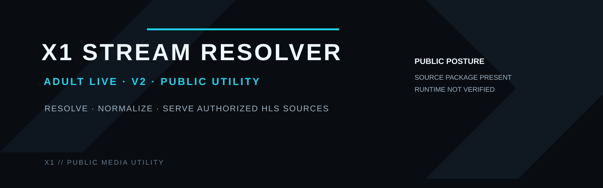
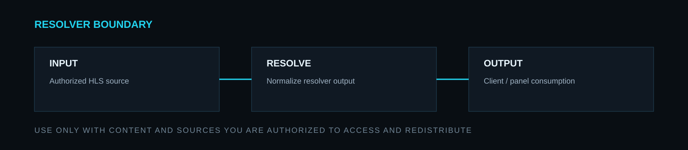

  <strong>PUBLIC · UTILITY · X1 SOFTWARE</strong> 
  Resolver and normalization tooling for authorized HLS live-stream sources.

  <a href="https://x1panel.space"><strong>WEBSITE</strong></a>
  &nbsp;·&nbsp;
  <a href="https://forum.x1panel.space"><strong>FORUM</strong></a>
  &nbsp;·&nbsp;
  <a href="https://discord.gg/vSSw6jHmw"><strong>DISCORD</strong></a>
  &nbsp;·&nbsp;
  <a href="https://t.me/+XkuQS_QuD6g4Nzc0"><strong>TELEGRAM</strong></a>

---

## X1 Adult Live Stream Resolver v2

**Public X1 utility for resolving and normalizing authorized HLS live-stream sources.**

This repository currently ships a packaged obfuscated v2 release. Package presence in Git does not prove that every upstream source is online, that every channel still resolves, that response time meets a fixed threshold or that a particular deployment environment is runtime-compatible.

> **Free means functional.**
> Public X1 software is intended to be useful as released, while runtime claims remain evidence-based.

---

## Operational surface

The resolver is intended to sit between an authorized upstream HLS source and a client or control surface, providing a stable resolver endpoint and normalized output for integrations that need it.

---

## Control loop

`RECEIVE AUTHORIZED SOURCE → RESOLVE → NORMALIZE → DELIVER → VERIFY OUTPUT`

Current repository evidence proves that an obfuscated v2 release archive is present:

`adults_script_v2.0_OBFUSCATED.zip`

That is **PROVEN BY SOURCE / REPOSITORY CONTENT** only.

`PACKAGE PRESENT ≠ TESTED ≠ RUNTIME VERIFIED`

---

## General compatibility target

The packaged utility is designed for PHP/web-server deployment and HLS-oriented integrations. Exact support for a PHP release, web server, player, panel or load-balancer environment must be validated against that target rather than inferred from this README.

---

## Usage boundary

Use this project only with streams and content that you are authorized to access, process and redistribute. This repository does not grant rights to third-party channels, feeds, trademarks or programming.

Do not use the resolver to bypass authentication, subscription controls, DRM, access-control mechanisms or other technical restrictions protecting content you are not authorized to access.

---

## Operational guidance

- deploy the release in an isolated application path;
- keep production credentials and provider secrets outside the web root and outside Git;
- expose only the endpoints required by the integration;
- validate TLS, CORS and proxy behavior in the actual deployment environment;
- measure resolver latency from the real deployment instead of relying on fixed performance claims;
- treat upstream availability as external state that can change independently of the resolver;
- monitor failures and fail closed where source authorization or resolver state is ambiguous.

---

## Runtime authority

When describing the project, distinguish:

`PROVEN BY SOURCE` · `PROVEN BY TEST` · `PROVEN BY RUNTIME` · `INFERRED` · `UNKNOWN / UNPROVEN` · `RUNTIME NOT VERIFIED`

Absolute claims such as every listed source being online, fixed sub-200 ms behavior or “100% working” are not maintained because repository content cannot prove them continuously.

---

## Related X1 systems

- [X1 IPTV Platform](https://github.com/x1-dotcom/x1-panel-iptv)
- [X1 Stream Manager Community](https://github.com/x1-dotcom/X1-Stream-Manager-Community)
- [X1 GitHub Profile](https://github.com/x1-dotcom/x1-dotcom)

---

## Community

- Forum — https://forum.x1panel.space
- Discord — https://discord.gg/vSSw6jHmw
- Telegram — https://t.me/+XkuQS_QuD6g4Nzc0

---

  <strong>RESOLVE THE SOURCE. VERIFY THE OUTPUT. USE AUTHORIZED CONTENT.</strong>  
  <strong>X1 // SOFTWARE · SYSTEMS · OPERATIONS</strong>  
  PUBLIC SOFTWARE. PRIVATE ENGINEERING. ONE X1 IDENTITY.  
  <strong>© X1Tech Solutions SA · All Rights Reserved</strong>

